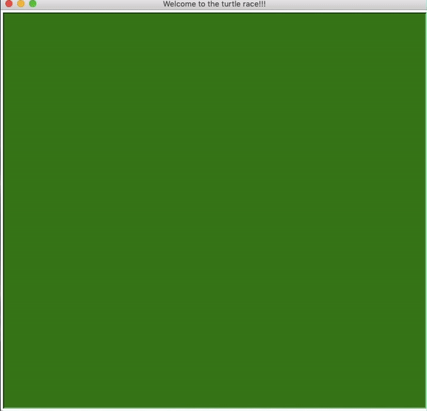

# Turtle Race

  

[](https://www.python.org/)

  

[](https://www.python.org/downloads/release/python-380/)

  

[](https://github.com/AkashSDas)

  

[](https://github.com/AkashSDas)

  

[](LICENSE)

  

  

## Table of contents

  

  

*  [About](#about)

  

*  [Technologies Used](#technologies-used)

  

*  [Installation](#installation)

  

*  [License](#license)

  

  

## About

  

> A simple graphics and fun turtle race game built using `Turtle` module in `Python` language.


  

## Technologies Used

  

> [](https://www.python.org/downloads/release/python-380/) is used as Programming Language.

  

> `Turtle` module is used for the `graphics`.

  
  

## Installation

  
  
  

#### With out using virtual-environment

  

`If you are just intersted in the graphics script then follow the below instructions.`

  

- First, start by closing the repository

```bash
git clone https://github.com/AkashSDas/Turtle-Race
```

- Go to the `src` folder

```bash
cd Turtle-Race/venv/src/
```

  

In folder `Turtle-Race/venv/src/` there is `main.py` which is the graphics script.

  

* To start the `graphics` do

```bash
python main.py
```

  
  

##### If you don't want to use virtual-environment then no need to proceed further since now you have the graphics script.

  

#### With using virtual-environment

  

>It is **recommended** to use **`virtual enviroment`** for this project to avoid any issues related to dependencies.

Here **`pipenv`** is used for this project.

  

- First, start by closing the repository

```bash
git clone https://github.com/AkashSDas/Turtle-Race
```

  

- Start by installing **`pipenv`** if you don't have it

```bash
pip install pipenv
```

  

- Once installed, access the venv folder inside the project folder

  

```bash
cd  'Turtle-Race'/venv/
```

  

- Create the virtual environment

  

```bash
pipenv install
```

  

The **Pipfile** of the project must be for creating replicating project's virtual enviroment.

  

This will install all the dependencies and create a **Pipfile.lock** (this should not be altered).

  

- Enable the virtual environment

  

```bash
pipenv shell
```

  

* The `graphics` script is in `src` folder.

```bash

cd src/

```

* To start the `graphics` do

```bash

python main.py

```

  
  

## License

  

  

This project is licensed under the MIT License - see the [MIT LICENSE](LICENSE) file for details.
